  

# Shrishesha Narmatesshvara

    <strong>Crafting resilient infrastructure from India 🌍</strong> — Designing systems end‑to‑end.

<table style="width:100%;max-width:900px;border-collapse:collapse;text-align:center;">
  <tr>
    <td style="padding:12px;vertical-align:top;width:33%;">
       
      <strong>Websites & Landing Pages</strong> 
      <small>React • Next.js • HTML/CSS</small>
    </td>
    <td style="padding:12px;vertical-align:top;width:33%;">
       
      <strong>Solutions & Integrations</strong> 
      <small>APIs • GraphQL • Webhooks</small>
    </td>
    <td style="padding:12px;vertical-align:top;width:33%;">
       
      <strong>Servers</strong> 
      <small>Docker • Nginx • Systemd</small>
    </td>
  </tr>
  <tr>
    <td style="padding:12px;vertical-align:top;">
       
      <strong>Monitoring & Observability</strong> 
      <small>Grafana • Prometheus • Loki</small>
    </td>
    <td style="padding:12px;vertical-align:top;">
       
      <strong>DevOps & CI/CD</strong> 
      <small>Docker • GitHub Actions • IaC</small>
    </td>
    <td style="padding:12px;vertical-align:top;">
       
      <strong>Mobile App Development</strong> 
      <small>React Native • Expo • Three.js</small>
    </td>
  </tr>
</table>

  
  
  
  
  
  

---

## 🚀 Mission-Driven Engineering

  <em>Building <b>systems</b> that runs reliably 24/7 with minimal intervention</em>

  
  

---

## 🏗️ Technical Architecture

<table>
    <tr>
        <td width="33%" style="padding:8px;">
            

                

                    
                    
                

                
⚙️ <strong>Production APIs</strong>

                

                    FastAPI · <em>Observability-first</em> 
                    <small>Microservices with tracing &amp; metrics</small>
                

            

        </td>
        <td width="33%" style="padding:8px;">
            

                

                    
                    
                    
                

                
🏠 <strong>Homelabbing</strong>

                

                    Jellyfin · Immich · Proxmox 
                    <small>Self-hosted media &amp; virtualization</small>
                

            

        </td>
        <td width="33%" style="padding:8px;">
            

                

                    
                    
                

                
🔐 <strong>Network Security</strong>

                

                    ESP32/Pi Honeypots · Tailscale 
                    <small>Edge sensors &amp; secure tunnels</small>
                

            

        </td>
    </tr>
    <tr>
        <td width="33%" style="padding:8px;">
            

                

                    
                    
                    
                

                
📊 <strong>Monitoring Stack</strong>

                

                    Grafana · Prometheus · Uptime Kuma 
                    <small>24/7 telemetry &amp; alerting</small>
                

            

        </td>
        <td width="33%" style="padding:8px;">
            

                

                    
                    
                    
                

                
📱 <strong>Mobile App Dev</strong>

                

                    React Native · Expo · TypeScript 
                    <small>High-performance mobile apps with modern tooling &amp; OTA updates</small>
                

            

        </td>
        <td width="33%" style="padding:8px;">
            

                

                    
                    
                

                
⚡ <strong>Automation</strong>

                

                    Docker Compose · GitHub Actions 
                    <small>IaC &amp; zero‑downtime CI/CD</small>
                

            

        </td>
    </tr>
    <tr>
        <td width="33%" style="padding:8px;">
            

                

                    
                    
                

                
🐳 <strong>Container Platforms</strong>

                

                    Docker · Swarm · Compose 
                    <small>Service meshes, stacks &amp; reproducible environments</small>
                

            

        </td>
        <td width="33%" style="padding:8px;">
            

                

                    
                

                
☸️ <strong>Orchestration</strong>

                

                    Kubernetes  
                    <small>Declarative deployments &amp; scalable workloads</small>
                

            

        </td>
        <td width="33%" style="padding:8px;">
            

                

                    
                    
                    
                

                
🎮 <strong>3D · Game · XR</strong>

                

                    Blender · Unity · VR/AR 
                    <small>Real‑time 3D worlds, prototyping &amp; interactive experiences</small>
                

            

        </td>
    </tr>
</table>

---

## 🛠️ Tech Stack

##                                                               

## 📈 Developer Analytics

<table>
    <tr>
        <td width="50%" style="padding:8px;">
            
        </td>
        <td width="50%" style="padding:8px;">
            
        </td>
    </tr>
</table>

  

## 
<table style="width:100%; border-collapse:collapse;">
    <thead>
        <tr>
            <th style="text-align:left; padding:8px; border-bottom:1px solid #444;">🔥 Set Aside</th>
            <th style="text-align:left; padding:8px; border-bottom:1px solid #444;">🚧 In Progress</th>
            <th style="text-align:left; padding:8px; border-bottom:1px solid #444;">✅ Done</th>
        </tr>
    </thead>
    <tbody>
        <tr>
            <td style="vertical-align:top; padding:12px;">
                <ul>
                    <li>
                        <strong>🎮 3D Mobile Studio</strong> — GLB model viewer 
                         
                         
                        
                    </li>
                    <li style="margin-top:8px;">
                        <strong>🔐 ESP32 Sentinel</strong> — Network honeypot firewall 
                         
                         
                        
                    </li>
                </ul>
            </td>
            <td style="vertical-align:top; padding:12px;">
                <ul>
                    <li>
                        <strong>🏗️ Homelab Core</strong> — Media server + photo backup 
                         
                         
                         
                        
                    </li>
                    <li style="margin-top:8px;">
                        <strong>☁️ Distributed Cloud Scheduler & Resource Allocation Simulator</strong> — High-performance C++ core engine · Rust safety/orchestration layer · Web-based frontend GUI 
                         
                         
                        
                    </li>
                </ul>
            </td>
            <td style="vertical-align:top; padding:12px;">
                <ul>
                    <li>
                        <strong>✅ API Observatory</strong> — Production monitoring 
                         
                         
                    </li>
                    <li>
                        <strong>Much more in the <a href="https://github.com/Shrishesha4?tab=repositories">/repos</a> page</strong>
                    </li>
                </ul>
            </td>
        </tr>
    </tbody>
</table>

---

## 🎯 Current Focus

```mermaid
flowchart TD
  A[🐳 Homelab Orchestration] --> B[Docker Swarm + Portainer]
  C[🔐 ESP32 Network Defense] --> D[Intrusion Detection Firmware]
  E[📱 Immersive 3D Mobile] --> F[AR/VR GLTF Rendering]
  G[📊 Chaos Engineering] --> H[Load Testing + Observability]
```

---

## 💝 Support My Work

  
  

---

  

   
  <b>✨ shrishesha4 | Engineered with precision</b>

